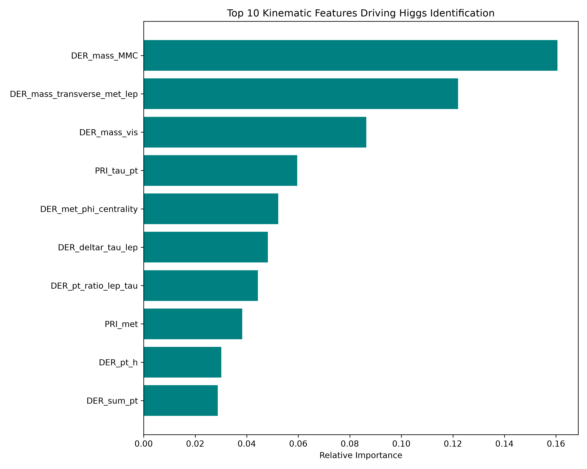
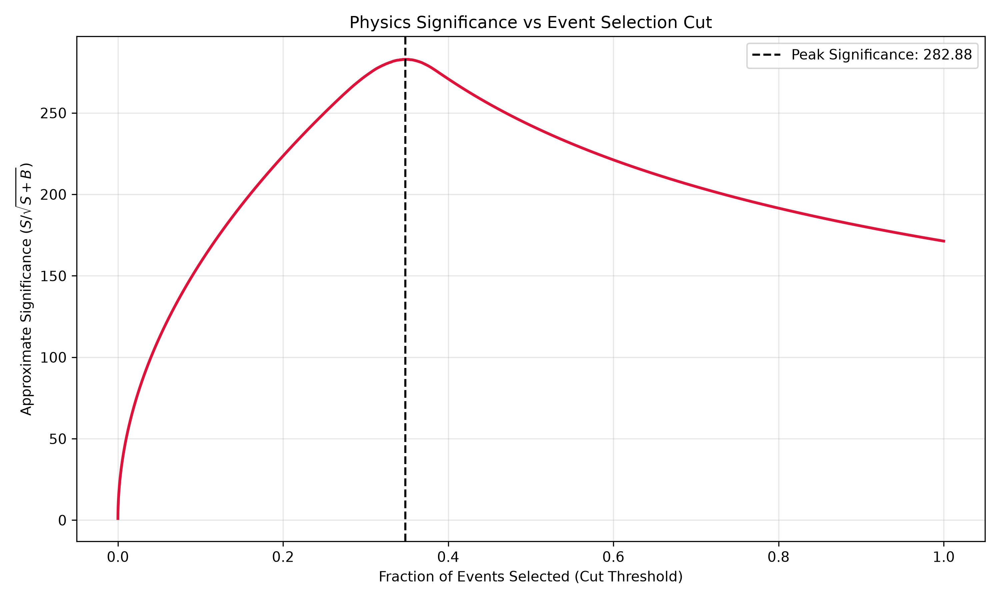
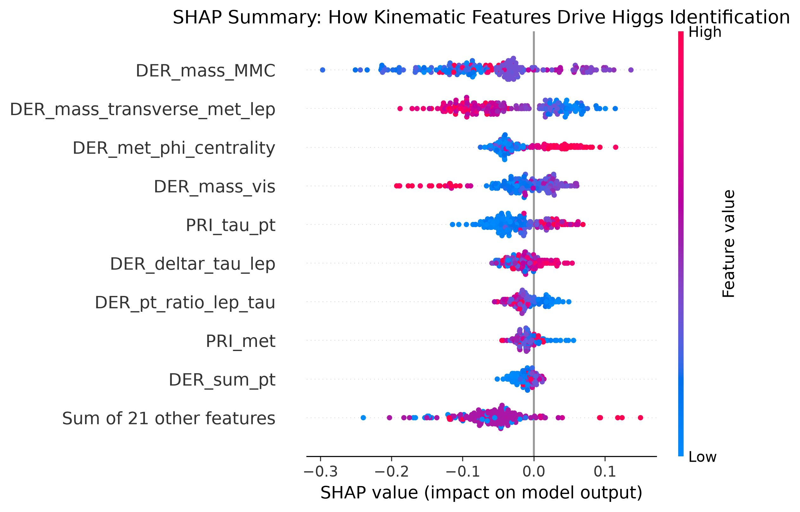
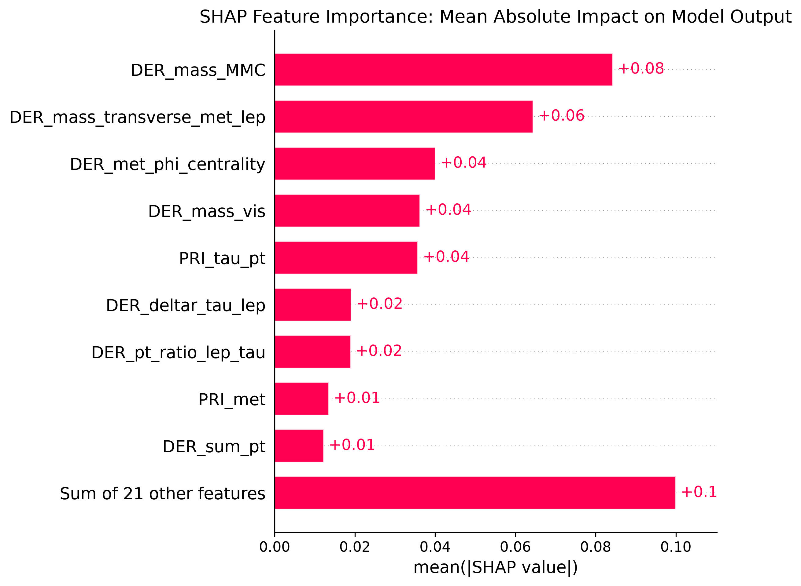
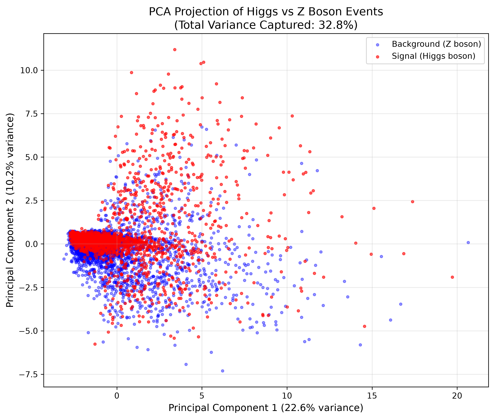

## 📊 Advanced Statistical Analysis

To ensure the model's robustness and physical validity, the project goes beyond standard accuracy metrics:

### 1. Feature Importance & Physics Validation
By extracting feature importances from the Random Forest, we verified that the model prioritizes kinematic variables consistent with Standard Model physics:
*   **`DER_mass_MMC`** (Matrix Element Method mass) and **`DER_mass_transverse_met_lep`** (Transverse Mass) were the top predictors.
*   This confirms the model successfully learned to identify the kinematic signatures of heavy particle decays and missing energy (neutrinos).

### 2. Maximizing Discovery Significance
In High Energy Physics, the goal is to maximize statistical significance ($S/\sqrt{S+B}$). 
*   We plotted the significance curve against the event selection cut.
*   The analysis identifies an optimal threshold (selecting the top ~35% of confident events) that maximizes the signal-to-background ratio, yielding a peak significance of **282.88** on the test dataset.

## 🧠 Advanced Explainable AI (SHAP Analysis)

To ensure the model's decisions are physically interpretable, we utilized **SHAP (SHapley Additive exPlanations)**. This allows us to open the "black box" and verify that the model is learning actual kinematic laws rather than dataset artifacts.

### 1. SHAP Summary (Beeswarm Plot)
The beeswarm plot visualizes the impact of each feature on the model's output. 
*   **Red dots** indicate high feature values; **Blue dots** indicate low feature values.
*   **Key Insight:** For the top feature `DER_mass_MMC` (Matrix Element Method Mass), high values (red) consistently push the prediction toward the **Signal class** (positive SHAP value), while low values push toward **Background**. This confirms the model has learned that heavier parent particles (Higgs, 125 GeV) are distinct from lighter ones (Z, 91 GeV).

### 2. Feature Importance Ranking
The bar plot ranks features by their mean absolute impact on the model output. The top three features (`DER_mass_MMC`, `DER_mass_transverse_met_lep`, and `DER_met_phi_centrality`) are all derived kinematic variables related to transverse mass and missing energy, validating the physical intuition that these are the strongest discriminators for Higgs identification.

## 📉 Unsupervised Exploratory Data Analysis (PCA)

To understand the global structure of the 28-dimensional kinematic space, we applied Principal Component Analysis (PCA).

*   **Variance Captured:** The first two principal components capture **32.8%** of the total variance (PC1: 22.6%, PC2: 10.2%), which is typical for complex, high-dimensional collider data.
*   **Physical Observation:** While the Signal (Higgs) and Background (Z boson) events overlap heavily in the low-energy core, the PCA projection reveals that Signal events possess a distinct "high-energy tail" extending into the upper-right quadrant (high PC1 and PC2). 
*   **Conclusion:** This visual confirms that while the classes are not linearly separable, the Higgs events systematically occupy a higher-energy region of the phase space due to the larger mass of the parent particle. This non-linear separation is exactly what our Random Forest model successfully exploits.

